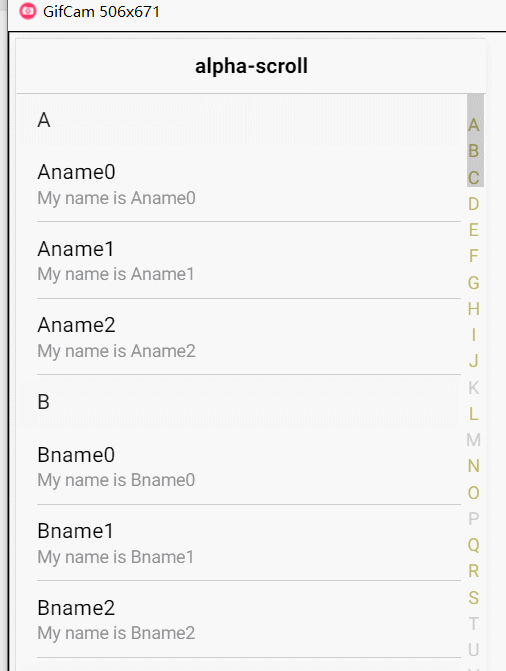

# ion-alpha-scroll

## 来源

在原作者的基础上增加支持拼音，原作者项目如下:

[squallliu/ion-alpha-scroll](https://github.com/squallliu/ion-alpha-scroll)

[squallliu/ionic2-demo](https://github.com/squallliu/ionic2-demo)

## 效果



## 安装

1. 安装模块:

```bash
$ npm install ion-alpha-scroll --save
```

2. 导入模块

```typescript
// Import your library
import { AlphaScrollModule } from 'ion-alpha-scroll';

@NgModule({
  declarations: [
    xxComponent
  ],
  imports: [
    xxModule,
    // 导入模块
    AlphaScrollModule.forRoot()
  ],
  providers: [],
  bootstrap: [xxComponent]
})
export class AppModule { }
```

## 使用

```html
<ion-header>
  <ion-navbar>
    <ion-title>alpha-scroll</ion-title>
  </ion-navbar>
</ion-header>
<ion-content>
  <ion-alpha-scroll *ngIf="breeds" [listData]="breeds" key="name" [itemTemplate]="alphaScrollItemTemplate"
                    [currentPageClass]="currentPageClass">
  </ion-alpha-scroll>
</ion-content>
<ng-template #alphaScrollItemTemplate let-item="item" let-currentPageClass="currentPageClass">
  <ion-item (click)="currentPageClass.onItemClick(item)">
    <h2>{{item.name}}</h2>
    <p>{{item.description}}</p>
  </ion-item>
</ng-template>
```

```ts
import { Component } from '@angular/core';
import { NavController } from 'ionic-angular';

@Component({
  selector: 'page-home',
  templateUrl: 'home.html'
})
export class HomePage {
  breeds: Array<any> = [];
  currentPageClass = this;
  constructor(public navCtrl: NavController) {
    this.breeds = [{
      name: '测试',
      description: '测试'
    },{
      name: '张三',
      description: '张三'
    },{
      name: '李四',
      description: '李四'
    },{
      name: '王五',
      description: '王五'
    }]
    let str: string = 'RHINSXYABCJLDEFGOQ';
    for (let i: number = 0; i < str.length; i++) {
      let nextChar: string = str.charAt(i);
      for (let j: number = 0; j < 3; j++) {
        let name: string = nextChar + 'name' + j;
        this.breeds.push({
          name: name,
          description: 'My name is ' + name
        });
      }
    }
  }
}

```

## License

MIT © [chenyuan](mailto:chenyuanchn@foxmail.com)
